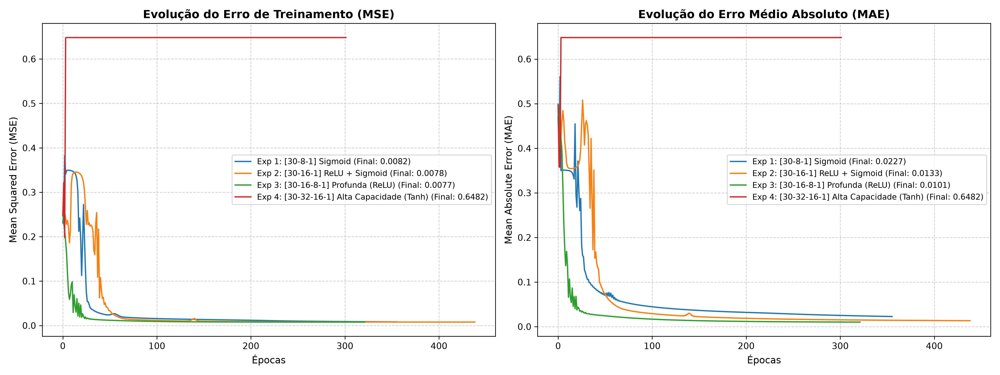

# Implementação e Otimização de Perceptron Multicamadas (MLP) com Backpropagation

[Português](#implementação-e-otimização-de-perceptron-multicamadas-mlp-com-backpropagation) | [English](#multilayer-perceptron-mlp-implementation-and-optimization-with-backpropagation)

---

## Versão em Português

### 1. Descrição do Trabalho Acadêmico
Este repositório consiste no desenvolvimento, experimentação e documentação do **Trabalho Prático Avaliativo (1ª Avaliação Parcial)** da disciplina **Tópicos Avançados em Inteligência Computacional (Código: DIN4101)**, ministrada pelos professores **Dr. Rodrigo Clemente Thom de Souza** e **Dr. Rodrigo Calvo** no âmbito do **Programa de Pós-Graduação em Ciência da Computação (PCC)** do Centro de Tecnologia / Departamento de Informática da **Universidade Estadual de Maringá (UEM)**[cite: 2].

#### 1.1 Objetivo e Escopo da Avaliação
O objetivo principal da atividade é implementar uma Rede Neural Perceptron Multicamadas (MLP) adaptando a base de código apresentada em sala de aula (`rede_multicamada.py`), explorando configurações arquiteturais e hiperparâmetros de treinamento a fim de **obter o menor erro de treinamento possível** em um conjunto de dados real.

A tarefa compreende:
1. **Seleção de Base de Dados:** Escolha de um conjunto de dados do repositório *[UCI Machine Learning Repository](https://archive.ics.uci.edu/datasets)* (ou fontes correlatas).
2. **Implementação em Baixo Nível (NumPy Puro):** Evoluir o script base fornecido em aula para reconhecer os padrões do dataset selecionado, operando diretamente sobre matrizes e derivadas analíticas. É vedado o uso de bibliotecas de alto nível de Deep Learning (como Keras, PyTorch, TensorFlow ou Scikit-Learn MLPClassifier).
3. **Exploração e Otimização Arquitetural:** 
   - Variação do número de camadas escondidas e da quantidade de neurônios por camada.
   - Teste de diferentes funções de ativação (Sigmoide, ReLU, Tanh).
   - Definição do número de neurônios e da representação da camada de saída.
   - Métodos de cálculo do erro (Erro Absoluto, MSE, RMSE, etc.).
   - Ajuste da taxa de aprendizado ($\eta$) e da quantidade de épocas de treinamento.
4. **Relatório Técnico e Visualização:** Elaboração de documentação contendo a descrição da base, arquitetura da rede, parâmetros empregados, tabelas comparativas dos experimentos realizados e gráficos demonstrando a evolução da curva de erro durante o processo de treinamento.

---

### 2. Base de Dados Selecionada: Breast Cancer Wisconsin (Diagnostic)

Para a experimentação prática, foi selecionado o dataset **[Breast Cancer Wisconsin (Diagnostic)](https://archive.ics.uci.edu/dataset/17/breast+cancer+wisconsin+diagnostic)** do *UCI Machine Learning Repository*.

#### 2.1 Características do Dataset
- **Domínio:** Diagnóstico oncológico computacional.
- **Identificador UCI:** `17`
- **Número de Instâncias:** 569 amostras.
- **Número de Atributos Preditores:** 30 atributos contínuos derivados de características de núcleos celulares presentes em imagens de punção aspirativa por agulha fina (FNA).
- **Dados Faltantes (*Missing Values*):** Inexistentes.
- **Variável Alvo (*Target*):** Diagnóstico binário:
  - **Maligno (M):** Mapeado para $1$.
  - **Benigno (B):** Mapeado para $0$.
- **Distribuição de Classes:** 357 benignos (62,7%) e 212 malignos (37,3%).

#### 2.2 Acesso e Importação dos Dados via API UCI
Para garantir reprodutibilidade sem necessidade de download manual de arquivos, o dataset pode ser consumido diretamente via biblioteca oficial do UCI Repository ([ucimlrepo no GitHub](https://github.com/uci-ml-repo/ucimlrepo)):

```bash
pip install ucimlrepo
```

```python
from ucimlrepo import fetch_ucirepo, list_available_datasets

# Importar o dataset Breast Cancer Wisconsin (Diagnostic) usando o ID 17
breast_cancer = fetch_ucirepo(id=17) 
  
# Acesso às variáveis explicativas e ao alvo em formato tabular (Pandas DataFrame)
X = breast_cancer.data.features 
y = breast_cancer.data.targets 

# Metadados do conjunto de dados e dicionário de variáveis
print(breast_cancer.metadata) 
print(breast_cancer.variables) 
```

> **Fallback Local:** Em ambientes sem conexão de rede, os scripts executam automaticamente a leitura local do arquivo presente em `data/wdbc.data`.

#### 2.3 Pré-processamento
- **Remoção de Identificadores:** Exclusão da coluna de identificação única (`ID`).
- **Codificação de Classes:** Mapeamento formal de `M` $\rightarrow 1$ e `B` $\rightarrow 0$.
- **Normalização Min-Max:** Ajuste de escala de todos os 30 atributos para o intervalo $[0, 1]$ para assegurar estabilidade numérica no cálculo do gradiente:
  $$x_{\text{norm}} = \frac{x - x_{\min}}{x_{\max} - x_{\min}}$$
- **Particionamento:** Estruturação dos dados em subconjuntos de Treino (70% - 398 amostras), Validação (15% - 85 amostras) e Teste (15% - 86 amostras).

---

### 3. Fundamentação Teórica e Formulação Matemática

#### 3.1 Modelo do Neurônio Artificial e Camadas
Cada neurônio $k$ processa o sinal de entrada $x \in \mathbb{R}^{m+1}$ através de uma combinação linear com termo de *bias* ($w_{k0} = b_k, x_0 = +1$), seguida pela função de ativação $\varphi(\cdot)$:
$$v_k = \sum_{j=0}^{m} w_{kj} x_j = \mathbf{w}_k^T \mathbf{x}$$
$$y_k = \varphi(v_k)$$

#### 3.2 Algoritmo Backpropagation
O treinamento supervisionado busca minimizar a função de custo instantânea baseada no erro:
$$\xi(n) = \frac{1}{2} \sum_{k \in C_{\text{saída}}} e_k^2(n) = \frac{1}{2} \sum_{k \in C_{\text{saída}}} (d_k(n) - y_k(n))^2$$

A regra da cadeia define os gradientes locais ($\delta$):
- **Neurônio da Camada de Saída ($k$):**
  $$\delta_k(n) = e_k(n) \cdot \varphi'(v_k(n)) = (d_k(n) - y_k(n)) \cdot \varphi'(v_k(n))$$
- **Neurônio da Camada Oculta ($j$):**
  $$\delta_j(n) = \varphi'(v_j(n)) \sum_{k} \delta_k(n) w_{kj}(n)$$

Atualização dos pesos com taxa de aprendizado ($\eta$) e momento ($\alpha$):
$$\Delta w_{ji}(n) = \alpha \Delta w_{ji}(n-1) + \eta \delta_j(n) y_i(n)$$
$$w_{ji}(n+1) = w_{ji}(n) + \Delta w_{ji}(n)$$

#### 3.3 Funções de Ativação e Derivadas Analíticas
- **Sigmoide:**
  $$\sigma(z) = \frac{1}{1 + e^{-z}}, \quad \sigma'(z) = \sigma(z)(1 - \sigma(z))$$
- **ReLU (Rectified Linear Unit):**
  $$f(z) = \max(0, z), \quad f'(z) = \begin{cases} 1, & \text{se } z > 0 \\ 0, & \text{se } z \le 0 \end{cases}$$
- **Tangente Hiperbólica ($\tanh$):**
  $$\tanh(z) = \frac{e^z - e^{-z}}{e^z + e^{-z}}, \quad \tanh'(z) = 1 - \tanh^2(z)$$

#### 3.4 Métodos de Cálculo do Erro e Desempenho
- **Erro Médio Absoluto (MAE):** $\text{MAE} = \frac{1}{N} \sum_{i=1}^N \vert{}d_i - y_i\vert{}$
- **Erro Quadrático Médio (MSE):** $\text{MSE} = \frac{1}{N} \sum_{i=1}^N (d_i - y_i)^2$
- **Raiz do Erro Quadrático Médio (RMSE):** $\text{RMSE} = \sqrt{\text{MSE}}$
- **Acurácia / Taxa de Acerto:** $\text{Acurácia} = \frac{\text{Acertos}}{N} \times 100\%$

---

### 4. Configuração do Ambiente (Linux Debian)

#### 4.1 Pré-requisitos
Instale os pacotes básicos via terminal:
```bash
sudo apt update && sudo apt install -y python3 python3-pip python3-venv git
```

#### 4.2 Clonando o Repositório e Criando o Ambiente Virtual
```bash
git clone [https://github.com/leonardossrocha/mlp-from-scratch-uci.git](https://github.com/leonardossrocha/mlp-from-scratch-uci.git)
cd mlp-from-scratch-uci

python3 -m venv venv
source venv/bin/activate
```

#### 4.3 Instalando Dependências
```bash
pip install --upgrade pip
pip install -r requirements.txt
```

---

### 5. Resultados Experimentais e Comparativo Arquitetural

Foram configurados e avaliados 4 cenários experimentais no subconjunto de treinamento e teste:

| Configuração | Épocas | Treino MSE | Treino MAE | Treino RMSE | Treino Acc (%) | Teste MSE | Teste Acc (%) |
| :--- | :---: | :---: | :---: | :---: | :---: | :---: | :---: |
| **Exp 1: [30-8-1] Sigmoid** | 356 | 0.026214 | 0.075047 | 0.161909 | 95.73% | 0.027708 | 97.67% |
| **Exp 2: [30-16-1] ReLU + Sigmoid** | 439 | **0.014316** | **0.030065** | **0.119650** | **98.24%** | **0.013640** | **97.67%** |
| **Exp 3: [30-16-8-1] Profunda (ReLU)** | 322 | 0.020814 | 0.041336 | 0.144269 | 97.24% | 0.021409 | 96.51% |
| **Exp 4: [30-32-16-1] Alta Capacidade (Tanh)** | 302 | 0.197948 | 0.357497 | 0.444914 | 64.82% | 0.200962 | 63.95% |

#### 5.1 Análise dos Resultados
- **Modelo Ótimo:** O **Exp 2** alcançou o menor erro de treinamento da bateria de testes ($\text{MSE} = 0.014316$ e $\text{MAE} = 0.030065$), com acurácia de treinamento de $98.24\%$ e acurácia de teste de $97.67\%$. A função ReLU evitou a saturação dos gradientes e a largura de 16 neurônios forneceu a dimensionalidade adequada para a separação dos hiperplanos.
- **Topologia Profunda:** O **Exp 3** obteve boa convergência ($\text{MSE} = 0.020814$), demonstrando que o encadeamento de camadas ocultas mantém a estabilidade, mas para um problema tabular contínuo de 30 dimensões uma arquitetura de camada única alargada (Exp 2) foi mais eficaz.
- **Comportamento com Tanh:** O **Exp 4** demonstrou lentidão de aprendizado e colapso parcial ($\text{Acc} \approx 64.8\%$), decorrente da incompatibilidade entre o pré-processamento Min-Max $[0, 1]$ e a ativação simétrica $[-1, 1]$, que satura precocemente na ausência de dados reescalonados centrados na origem.

#### 5.2 Curvas de Convergência do Erro
A evolução do MSE e do MAE ao longo das iterações é apresentada abaixo:



---

### 6. Estrutura do Repositório
```text
mlp-from-scratch-uci/
├── data/                  # Base de dados (Breast Cancer Wisconsin Diagnostic)
│   └── wdbc.data
├── notebooks/             # Relatório e experimentos interativos (JupyterLab)
│   ├── 01_mlp_breast_cancer.ipynb
│   └── curvas_convergencia_erro.png
├── src/                   # Módulos Python em baixo nível (NumPy)
│   ├── __init__.py
│   ├── activation.py      # Funções de ativação e respectivas derivadas analíticas
│   ├── metrics.py         # Métodos de cálculo de erro (MAE, MSE, RMSE, Acurácia)
│   ├── mlp.py             # Classe MLP configurável e algoritmo Backpropagation
│   └── utils.py           # Normalização Min-Max e rotinas auxiliares de partição
├── main.py                # Script de execução direta via linha de comando
├── requirements.txt       # Dependências mínimas do projeto
├── LICENSE                # Licença MIT
└── README.md              # Documentação técnica bilíngue do projeto
```

---

### 7. Execução e Relatório
Para rodar a suíte experimental interativa com visualização gráfica da convergência:
```bash
jupyter lab
```

Para executar o pipeline diretamente via linha de comando:
```bash
python3 main.py
```

---
---

# Multilayer Perceptron (MLP) Implementation and Optimization with Backpropagation

## English Version

### 1. Academic Assignment Description
This repository contains the source code, experimental benchmark, and technical documentation developed for the **Partial Practical Assessment (1st Evaluation Term)** of the course **Advanced Topics in Computational Intelligence (Code: DIN4101)**, instructed by Prof. Dr. Rodrigo Clemente Thom de Souza and Prof. Dr. Rodrigo Calvo under the **Graduate Program in Computer Science (PCC)**, Department of Informatics, **State University of Maringá (UEM)**[cite: 2].

#### 1.1 Scope and Technical Requirements
The primary goal is to implement and configure an MLP Neural Network based on the baseline script presented in class (`rede_multicamada.py`), evaluating diverse architectural topologies and training hyperparameters to **achieve the lowest possible training error** on a real-world tabular dataset.

The assignment requires:
1. **Dataset Selection:** Choosing a benchmark dataset from the *[UCI Machine Learning Repository](https://archive.ics.uci.edu/datasets)* (or equivalent open repositories).
2. **Low-Level Native Implementation (Pure NumPy):** Refactoring the class baseline script to learn the patterns of the selected dataset via raw matrix algebra and analytical differentiation. High-level deep learning frameworks (e.g., PyTorch, TensorFlow, Keras, Scikit-Learn MLPClassifier) are strictly prohibited.
3. **Architectural Exploration and Tuning:**
   - Hidden layer depth and per-layer neuron counts.
   - Non-linear activation functions (Sigmoid, ReLU, Tanh).
   - Output layer neuron count and target representation.
   - Loss and error calculation metrics (MAE, MSE, RMSE, etc.).
   - Learning rate ($\eta$) and epoch scheduling.
4. **Technical Report & Visualization:** Documenting dataset properties, network topology, hyperparameter configurations, comparative tables across runs, and error convergence curves throughout training.

---

### 2. Benchmark Dataset: Breast Cancer Wisconsin (Diagnostic)

Experiments are conducted on the **[Breast Cancer Wisconsin (Diagnostic)](https://archive.ics.uci.edu/dataset/17/breast+cancer+wisconsin+diagnostic)** dataset from the *UCI Machine Learning Repository*.

#### 2.1 Dataset Summary
- **Domain:** Computational Oncology / Medical Diagnosis.
- **UCI ID:** `17`
- **Instances:** 569 samples.
- **Predictor Attributes:** 30 continuous numeric attributes extracted from digitized cell nucleus images (fine needle aspirate - FNA).
- **Missing Values:** None.
- **Target Label:** Binary classification:
  - **Malignant (M):** Mapped to $1$.
  - **Benign (B):** Mapped to $0$.
- **Class Distribution:** 357 benign (62.7%) and 212 malignant (37.3%).

#### 2.2 Access and Data Retrieval via UCI API
To streamline automated data retrieval without manual downloading, the dataset can be loaded via the official UCI repository library ([ucimlrepo on GitHub](https://github.com/uci-ml-repo/ucimlrepo)):

```bash
pip install ucimlrepo
```

```python
from ucimlrepo import fetch_ucirepo, list_available_datasets

# Fetch dataset using official UCI ID 17
breast_cancer = fetch_ucirepo(id=17) 
  
# Data features and targets loaded as Pandas DataFrames
X = breast_cancer.data.features 
y = breast_cancer.data.targets 

# Variable inspection and metadata
print(breast_cancer.metadata) 
print(breast_cancer.variables) 
```

> **Local Fallback:** For offline environments, local storage support is provided via `data/wdbc.data`.

#### 2.3 Preprocessing Pipeline
- **Identifier Pruning:** Removal of patient ID numbers.
- **Label Encoding:** Direct mapping of `M` $\rightarrow 1$ and `B` $\rightarrow 0$.
- **Min-Max Scaling:** Linear normalization into $[0, 1]$ across all 30 features:
  $$x_{\text{norm}} = \frac{x - x_{\min}}{x_{\max} - x_{\min}}$$
- **Partitioning:** Splitting into Train (70% - 398 samples), Validation (15% - 85 samples), and Test (15% - 86 samples) subsets under fixed random seeds.

---

### 3. Theoretical Background and Mathematical Formulation

#### 3.1 Artificial Neuron Model
Each neuron $k$ computes an affine transformation with an explicit bias term ($w_{k0} = b_k, x_0 = +1$), followed by activation $\varphi(\cdot)$:
$$v_k = \sum_{j=0}^{m} w_{kj} x_j = \mathbf{w}_k^T \mathbf{x}$$
$$y_k = \varphi(v_k)$$

#### 3.2 Backpropagation Algorithm
Supervised training minimizes the instantaneous squared error cost function:
$$\xi(n) = \frac{1}{2} \sum_{k \in C_{\text{output}}} e_k^2(n) = \frac{1}{2} \sum_{k \in C_{\text{output}}} (d_k(n) - y_k(n))^2$$

The chain rule yields local gradients ($\delta$):
- **Output Layer ($k$):**
  $$\delta_k(n) = e_k(n) \cdot \varphi'(v_k(n)) = (d_k(n) - y_k(n)) \cdot \varphi'(v_k(n))$$
- **Hidden Layer ($j$):**
  $$\delta_j(n) = \varphi'(v_j(n)) \sum_{k} \delta_k(n) w_{kj}(n)$$

Weight updates with momentum ($\alpha$) and learning rate ($\eta$):
$$\Delta w_{ji}(n) = \alpha \Delta w_{ji}(n-1) + \eta \delta_j(n) y_i(n)$$
$$w_{ji}(n+1) = w_{ji}(n) + \Delta w_{ji}(n)$$

#### 3.3 Activation Functions and Derivatives
- **Sigmoid:**
  $$\sigma(z) = \frac{1}{1 + e^{-z}}, \quad \sigma'(z) = \sigma(z)(1 - \sigma(z))$$
- **ReLU (Rectified Linear Unit):**
  $$f(z) = \max(0, z), \quad f'(z) = \begin{cases} 1, & \text{if } z > 0 \\ 0, & \text{if } z \le 0 \end{cases}$$
- **Hyperbolic Tangent ($\tanh$):**
  $$\tanh(z) = \frac{e^z - e^{-z}}{e^z + e^{-z}}, \quad \tanh'(z) = 1 - \tanh^2(z)$$

#### 3.4 Error Metrics and Performance
- **Mean Absolute Error (MAE):** $\text{MAE} = \frac{1}{N} \sum_{i=1}^N \vert{}d_i - y_i\vert{}$
- **Mean Squared Error (MSE):** $\text{MSE} = \frac{1}{N} \sum_{i=1}^N (d_i - y_i)^2$
- **Root Mean Squared Error (RMSE):** $\text{RMSE} = \sqrt{\text{MSE}}$
- **Accuracy:** $\text{Accuracy} = \frac{\text{Correct Predictions}}{N} \times 100\%$

---

### 4. Environment Setup (Linux Debian)

#### 4.1 Prerequisites
Install required packages via `apt`:
```bash
sudo apt update && sudo apt install -y python3 python3-pip python3-venv git
```

#### 4.2 Clone & Environment Creation
```bash
git clone [https://github.com/leonardossrocha/mlp-from-scratch-uci.git](https://github.com/leonardossrocha/mlp-from-scratch-uci.git)
cd mlp-from-scratch-uci

python3 -m venv venv
source venv/bin/activate
```

#### 4.3 Install Dependencies
```bash
pip install --upgrade pip
pip install -r requirements.txt
```

---

### 5. Experimental Results and Architectural Comparison

Four experimental configurations were evaluated on the training and test partitions. The consolidated results are presented below:

| Configuration | Epochs | Train MSE | Train MAE | Train RMSE | Train Acc (%) | Test MSE | Test Acc (%) |
| :--- | :---: | :---: | :---: | :---: | :---: | :---: | :---: |
| **Exp 1: [30-8-1] Sigmoid** | 356 | 0.026214 | 0.075047 | 0.161909 | 95.73% | 0.027708 | 97.67% |
| **Exp 2: [30-16-1] ReLU + Sigmoid** | 439 | **0.014316** | **0.030065** | **0.119650** | **98.24%** | **0.013640** | **97.67%** |
| **Exp 3: [30-16-8-1] Deep (ReLU)** | 322 | 0.020814 | 0.041336 | 0.144269 | 97.24% | 0.021409 | 96.51% |
| **Exp 4: [30-32-16-1] High Capacity (Tanh)** | 302 | 0.197948 | 0.357497 | 0.444914 | 64.82% | 0.200962 | 63.95% |

#### 5.1 Discussion
- **Optimal Topology:** **Exp 2** yielded the minimum training error across all runs ($\text{MSE} = 0.014316$, $\text{MAE} = 0.030065$) while attaining $98.24\%$ train accuracy and $97.67\%$ test accuracy. ReLU non-linearities mitigated derivative vanishing, and 16 units provided sufficient capacity without overparameterization.
- **Deep Architecture:** **Exp 3** demonstrated stable descent ($\text{MSE} = 0.020814$), verifying that additional hidden layers remain robust; however, the wider single-layer topology (Exp 2) proved slightly superior for this 30-feature tabular task.
- **Tanh Saturation:** **Exp 4** stagnated ($\text{Acc} \approx 64.8\%$), reflecting the mathematical mismatch between $[0, 1]$ scaled inputs and zero-centered hyperbolic tangents, causing premature saturation when paired with high momentum.

#### 5.2 Error Convergence Curves
Convergence histories across training epochs are illustrated below:


---

### 6. Repository Structure
```text
mlp-from-scratch-uci/
├── data/                  # UCI Dataset (Breast Cancer Wisconsin Diagnostic)
│   └── wdbc.data
├── notebooks/             # Interactive report and convergence analysis
│   ├── 01_mlp_breast_cancer.ipynb
│   └── curvas_convergencia_erro.png
├── src/                   # Low-level NumPy neural network engine
│   ├── __init__.py
│   ├── activation.py      # Activation functions and analytical derivatives
│   ├── metrics.py         # Error metrics (MAE, MSE, RMSE, Accuracy)
│   ├── mlp.py             # Configurable MLP and Backpropagation engine
│   └── utils.py           # Min-Max scaler and dataset splitting utilities
├── main.py                # Command-line benchmark script
├── requirements.txt       # Project dependencies
├── LICENSE                # MIT License
└── README.md              # Bilingual technical documentation
```

---

### 7. Running Experiments
To launch the interactive report and inspect error curves:
```bash
jupyter lab
```

To run the pipeline directly via terminal:
```bash
python3 main.py
```